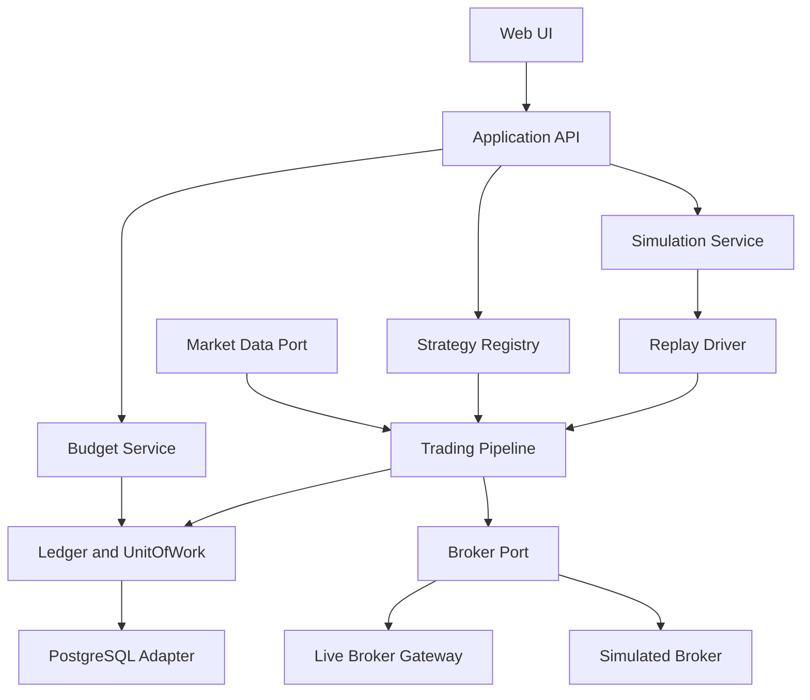
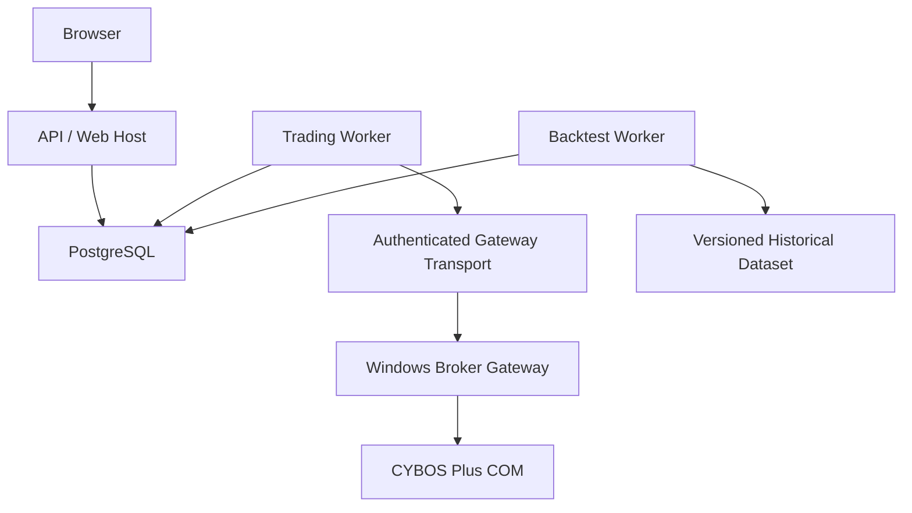
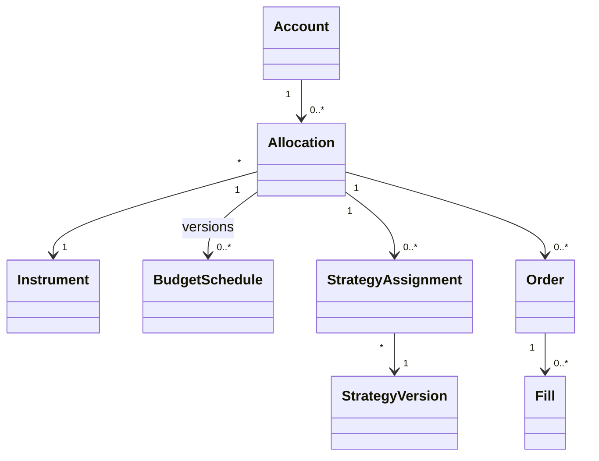
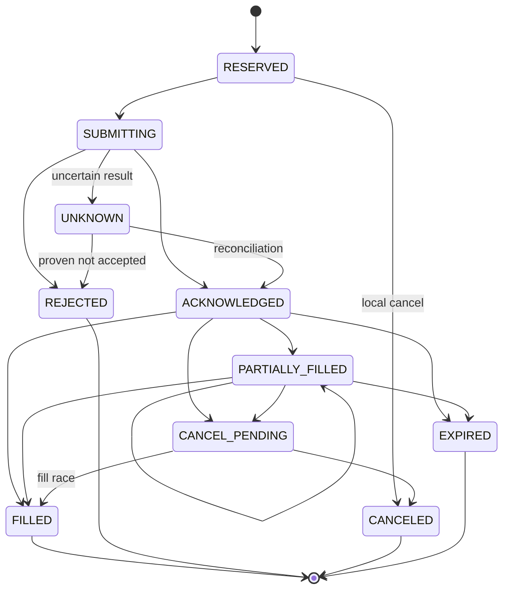

# Quantro Software Architecture Specification v0.1

| 항목 | 내용 |
|---|---|
| 제품 / Repository | Quantro / `quantro` |
| 버전 | 0.1 |
| 작성일 | 2026-10-01 |
| 상태 | 초기 구현을 위한 설계 기준안 |
| 목적 | 종목별 누적 예산, 교체 가능한 전략, 비교 가능한 백테스트, 브로커 독립 실행 |
| 최초 브로커 | 대신증권 CYBOS Plus를 기본 후보로 사용 |
| 언어 | 한국어; 코드와 식별자는 영어 |

> 이 문서의 MUST는 필수 구현 계약, SHOULD는 권장, MAY는 선택 기능을 뜻한다. 기술 스택과 초기 정책은 v0.1 설계 결정이며, 브로커별 실제 지원 범위는 연결 검증으로 확정한다. 본 문서는 수익을 보장하는 매매 전략을 정의하지 않는다.

## 목차

1. 목적과 범위
2. 요구사항 및 품질 목표
3. 아키텍처 결정과 경계
4. 컴포넌트 및 배포 구조
5. 도메인 모델과 자금 계약
6. 예산 스케줄과 변경 정책
7. 전략 및 주문 수량 계약
8. 주문 실행과 장애 복구
9. 브로커 및 데이터 인터페이스
10. 백테스트와 비교
11. 데이터베이스 설계
12. REST API 및 실시간 이벤트
13. UI 명세
14. 보안, 운영 및 관측
15. 검증과 인수 기준
16. 구현 순서 및 Repository
17. 미확정 항목과 참고 자료

## 1. 목적과 범위

Quantro는 하나의 증권 계좌에서 투자 상품별 가상 자금을 분리하고, 정기적으로 예산을 추가하며, 전략이 생성한 의사결정을 실제 주문 또는 과거 데이터 시뮬레이션으로 실행하는 플랫폼이다.

핵심 원칙:

- Core Domain은 증권사 SDK, COM, HTTP, ORM을 참조하지 않는다.
- Strategy는 브로커 호출이나 원장 변경을 수행하지 않는다.
- Live / Paper / Backtest는 동일한 전략, 예산 규칙, 주문 수량 계산과 공통 위험 정책을 사용한다.
- 자금 변경과 체결 반영은 감사 가능한 기록과 함께 원자적으로 저장한다.
- 브로커의 기능 차이는 capability와 adapter로 표현한다.

### 1.1 초기 구현 범위

단일 사용자, 하나의 KRW 계좌, 국내 상장 주식 및 ETF, 정수 주식 수량, 현금 매수와 보유량 내 매도, 일봉 기반 전략 및 백테스트를 기본으로 한다. 사용자가 말한 S&P500은 지수 자체가 아니라 선택한 실제 상장 ETF의 `instrument_id`에 매핑한다.

한 종목에 여러 전략을 연결할 수 있다. 초기에는 계좌 내 동일 종목당 하나의 Allocation만 허용한다. 동일 종목의 장기/스윙 sleeve 분리는 체결 소유권과 외부 거래 배분 정책을 추가한 후 확장한다.

### 1.2 후속 범위

추가 브로커, 다중 계좌, 해외 상품, 통화별 원장 및 환전, 분봉/틱, 동일 종목의 여러 sleeve, 가중 전략 결합, 공매도·신용·파생상품은 후속 범위다. 현재 인터페이스에 확장 지점을 두되, 지원되지 않는 주문은 명시적으로 거절한다.

## 2. 요구사항 및 품질 목표

### 2.1 기능 요구사항

| ID | 요구사항 | 인수 기준 |
|---|---|---|
| FR-01 | 종목별 독립 예산 | A 자금으로 B 주문을 실행할 수 없음 |
| FR-02 | 주기별 누적 할당 | 매주 30만원 → 30/60/90만원, 자금 충분 시 |
| FR-03 | 주기와 금액 변경 | 90만원 유지; 월 100만원 변경 후 190/290만원 |
| FR-04 | 즉시 추가 | 290만원에 10만원 추가 → 300만원 |
| FR-05 | 계좌와 할당 시각화 | 1,000만원, A 100만원, B 500만원, 미할당 400만원 표시 |
| FR-06 | 전략 추가·수정·비활성화 | 코어 수정 없이 등록; 변경 버전 추적 |
| FR-07 | 비율 기반 주문 | 누적 budget의 x% 매수 / 가용 보유량의 y% 매도 |
| FR-08 | 자동 실행 | 신호→수량→위험 검사→예약→주문→체결 처리 |
| FR-09 | 과거 시뮬레이션 | 기간, 종목, 예산 스케줄, 전략을 선택 |
| FR-10 | 실행 비교 | 설정과 결과를 저장하여 여러 Run 비교 |
| FR-11 | 브로커 교체 | 공통 전략 코드 수정 없이 다른 adapter 연결 |
| FR-12 | 이력·복구·중지 | 재시작 후 중복 할당/체결 없음; 신규 주문 중지 가능 |

### 2.2 품질 시나리오

| ID | 상황 | 요구되는 동작 |
|---|---|---|
| QA-01 | 두 작업자가 동시에 동일 현금 사용 | 계좌/Allocation 잠금 후 하나만 승인; 원장 음수 방지 |
| QA-02 | 주문 전송 후 응답 타임아웃 | UNKNOWN 상태 유지, 자원 예약 유지, 조회 후 상태 확정 |
| QA-03 | 같은 체결 이벤트 재수신 | 체결과 원장에 한 번만 반영 |
| QA-04 | 예산 처리 직후 프로세스 종료 | 스케줄 occurrence 고유키로 중복 할당 방지 |
| QA-05 | 동일 Run을 재실행 | 코드·설정·데이터·seed 동일 시 결과와 거래 이력 동일 |
| QA-06 | 브로커 연결 단절 / 시세 지연 | 해당 계좌 신규 주문 차단; 복구 대사 후 재개 |
| QA-07 | 사용자 kill switch | 성공 응답 뒤 시작되는 신규 전송 차단; 이미 전송 중인 주문은 별도 대사 |

가용성 및 처리 지연의 정량 SLO는 실제 호스트/브로커 검증 후 확정한다. v0.1에서 초저지연 거래는 목표가 아니다.

## 3. 아키텍처 결정과 경계

| ADR | 결정 | 이유 / 영향 |
|---|---|---|
| ADR-01 | Hexagonal Architecture + Modular Monolith | 도메인 독립성과 단일 개발자의 구현 비용 균형 |
| ADR-02 | Python core, FastAPI, PostgreSQL | 전략 연구와 트랜잭션 자금 관리 |
| ADR-03 | React + TypeScript, ECharts | 예산·자산·Run 비교 UI |
| ADR-04 | 브로커 Gateway 별도 프로세스 | SDK 실행 환경과 장애를 코어에서 격리 |
| ADR-05 | 원장 및 outbox, 전체 event sourcing은 미적용 | 감사/재전송을 확보하면서 구현 복잡도 제한 |
| ADR-06 | 예산은 누적 할당 원금 | 평가손익으로 전략의 budget 기준이 자동 변하지 않음 |
| ADR-07 | 전략 버전과 설정을 불변 저장 | 과거 주문/Run 설명 및 재현 |
| ADR-08 | 결정적 이벤트 기반 백테스트 | 예산과 시장 이벤트의 시간 순서를 검증 가능 |
| ADR-09 | 초기 daily bar, 지정가 주문 | 체결 가정과 예약 금액을 명확히 제한 |
| ADR-10 | Redis와 메시지 브로커는 초기 선택사항 | 정합성의 권위는 PostgreSQL; 캐시 장애와 분리 |

모듈은 다른 모듈의 테이블을 직접 수정하지 않고 Application Service 또는 port를 사용해야 한다. Repository 구현은 infrastructure에 있으며 UnitOfWork가 트랜잭션 경계를 제공한다.

## 4. 컴포넌트 및 배포 구조

### 4.1 논리 컴포넌트

다음 Mermaid는 논리 의존성 흐름이며 UML 컴포넌트 표기법을 주장하지 않는다.



### 4.2 책임과 금지 사항

| 컴포넌트 | 책임 | 금지 |
|---|---|---|
| Portfolio | 계좌, 상품, Allocation 관리 및 조회 | 브로커 금액을 직접 자금에 덮어쓰기 |
| Budget | 스케줄, 즉시 추가, 할당 occurrence 처리 | 계좌 입금 없는 현금 생성 |
| Strategy Registry | 설치된 plugin, 버전, 설정 검증 | 미검증 사용자 코드를 API 프로세스에서 실행 |
| Strategy Runtime | 불변 context에서 intent 생성 | I/O, 시스템 시간, 직접 주문 |
| Decision Engine | 여러 intent의 충돌 해소 | 숨은 합산 / 무기록 우선순위 |
| Sizing / Risk | 수량 계산, 한도, 신선도, 자원 검사 | 현금 예약 없는 주문 승인 |
| Execution | 상태 기계, 전송, 취소, 대사 | timeout 주문 무조건 재전송 |
| Ledger | 자금·수량 예약, 체결, 감사 기록 | 평가금과 원금 혼합 |
| Simulation | 가상 시계, 데이터 재생, 가상 체결 | 미래 데이터 전달 |
| Analytics | NAV, 수익률, 비교 | 입금액을 투자 수익으로 계산 |
| Broker Gateway | SDK 변환, 조회, 전송, heartbeat | 전략 의사결정 |

### 4.3 배포



API와 worker는 같은 패키지의 별도 프로세스다. Trading Worker는 계좌별 단일 writer lease와 DB lock을 사용한다. Backtest는 실거래 DB의 계좌 원장을 수정하지 않는 독립 run namespace에서 동작한다.

CYBOS Plus 공식 소개와 FAQ는 Windows COM 및 API 호출 응용프로그램의 32비트 요구를 설명한다.[S1][S2] 따라서 core/API/분석 환경은 64비트로 유지하고, 대신증권 gateway의 SDK 호출 부분은 Windows 32비트 Python 후보로 격리한다. 정확한 Python/SDK 버전, 관리자 권한, 로그인 및 재접속 절차는 구현 전 호스트에서 검증한다. Linux Docker에 COM gateway를 포함하지 않는다.

## 5. 도메인 모델과 자금 계약

### 5.1 주요 관계



### 5.2 용어와 식

모든 금액은 통화를 포함한 Decimal이다. Float를 원장에 사용하지 않는다. KRW 초기 저장은 원 단위이며 중간 수량 계산은 Decimal로 처리한다.

| 필드 | 정의 |
|---|---|
| `allocated_principal` = B | 실제로 승인된 누적 할당 원금; 매수/매도·평가손익으로 바뀌지 않음 |
| `cash_total` = C | Allocation의 현금성 장부잔액, 예약액 포함; 미결제 매도대금 포함 가능 |
| `cash_reserved` = R | 미완료 매수 주문의 최대 대금+비용 예약 |
| `cash_unsettled` = U | 아직 재사용 불가한 미결제 금액 |
| `cash_available` = A | `C - R - U`; 사용 가능 현금 |
| `position_quantity` = Q | 체결에 의해 보유가 확정된 수량 |
| `quantity_reserved` | 미완료 매도 주문에 예약한 수량 |
| `quantity_available` | `Q - quantity_reserved` |
| `position_cost` = K | 잔존 보유분의 취득원가, 설정된 비용 포함 정책 적용 |
| `position_market_value` = V | `Q × 최신 평가 가격` |
| `allocation_nav` = N | `C + V` |
| `unallocated_cash` | 계좌 현금 중 어느 Allocation에도 배정되지 않은 금액 |

초기 계좌는 Quantro가 전체 계좌를 관리하며 공매도/부채가 없다고 가정한다. 기존 보유 종목은 초기 대사에서 명시적으로 가져온다. 가져오기 전에는 주문을 활성화하지 않는다.

계좌 현금의 장부식은 `account_cash_total = unallocated_cash + Σ C`이다. 현금 종류별(결제/미결제/예약) 세부 원장도 별도로 일치해야 한다. 계좌 평가식은 `account_nav = unallocated_cash + Σ N`이다. 브로커의 출금가능액·주문가능액·평가금은 각각 별도 snapshot 필드이며 같은 뜻으로 사용하지 않는다.

정기 할당은 **기존 미할당 현금의 내부 이동**이다. 자동 계좌 입금이 아니다. 예산은 미래 예정액과 승인 원금을 구분한다. 스케줄을 만들었다고 미입금 자금을 매수에 사용할 수 없다.

### 5.3 자금 예시

| 이벤트 | B | C | K | V | N |
|---|---:|---:|---:|---:|---:|
| 300만원 할당 | 3,000,000 | 3,000,000 | 0 | 0 | 3,000,000 |
| 100만원 매수, 비용 0 가정 | 3,000,000 | 2,000,000 | 1,000,000 | 1,000,000 | 3,000,000 |
| 보유분이 112만원으로 상승 | 3,000,000 | 2,000,000 | 1,000,000 | 1,120,000 | 3,120,000 |
| 전량 매도, 비용 0 가정 | 3,000,000 | 3,120,000 | 0 | 0 | 3,120,000 |

앞서 예시의 `available = budget - 현재 평가금` 방식은 사용하지 않는다. 미매수 현금 200만원은 평가손익으로 188만원이 되지 않는다. 실현 이익은 해당 Allocation 현금에 남고 재사용할 수 있으나, BUDGET_PERCENT의 분모 B는 300만원을 유지한다.

### 5.4 필수 불변조건

1. `B >= 0`, `A >= 0`, `Q >= 0`, 예약 금액/수량은 음수가 아니어야 한다.
2. 예약과 미결제의 합은 C를 초과하지 않아야 한다.
3. 신규 할당은 실제 미할당 사용 가능 현금 이내여야 한다.
4. 주문은 Allocation 현금과 계좌의 브로커 주문가능액 제한을 모두 만족해야 한다.
5. 체결은 한 번만 반영되고 항상 원장·포지션·예약 변화와 같은 트랜잭션에 저장된다.
6. 평가손익은 원장 현금과 할당 원금을 변경하지 않는다.
7. 계좌 간 또는 통화 간 자금 혼용은 허용하지 않는다.

불일치가 외부 거래/수수료/정정으로 발생하면 자동 숫자 보정 대신 계좌를 `RECONCILIATION_REQUIRED`로 전환하고 증빙 있는 조정 거래를 만든다.

## 6. 예산 스케줄과 변경 정책

### 6.1 모델

`BudgetScheduleVersion`은 `id, allocation_id, version, amount, currency, frequency, anchor_local, timezone, effective_from, effective_to, enabled`를 갖는다. 스케줄 기준 타임존은 `Asia/Seoul`, 저장 시각은 UTC, API는 ISO 8601 offset을 사용한다.

- DAILY/WEEKLY는 현지 달력 기준이며 WEEKLY는 7일 간격이다.
- MONTHLY는 달력 월 단위다. 기준일 31일이 없는 달은 말일에 실행하되 다음 달 기준일은 다시 31일이다.
- 예산 할당은 휴장일에도 수행한다. 매매는 거래소 달력에서 허용되는 때만 수행한다.
- 생성 시 첫 실행은 한 주기 뒤이며 UI에서 첫 실행 시점을 명시적으로 재지정할 수 있다.

### 6.2 주기 변경

기본 PATCH 정책은 `RESET_FROM_EFFECTIVE_TIME`이다. 변경 시점 이후 옛 버전의 미발생 occurrence는 취소하고, 새 버전의 첫 실행은 변경 시점으로부터 한 주기 뒤다. 기존 B와 발생 완료 이력은 유지한다.

예: B=900,000에서 월 1,000,000으로 변경 → 변경 직후 900,000 → 한 달 뒤 1,900,000 → 두 달 뒤 2,900,000. 변경 요청은 `effective_at`과 버전을 기록한다. 동일 시각 occurrence는 먼저 기한이 도래한 구버전 처리를 완료한 뒤 변경을 적용한다. v0.1은 미래 예약 변경을 지원하지 않는다.

### 6.3 스케줄 처리

`ScheduleOccurrence(schedule_version_id, due_at)` 고유키를 사용한다. 프로세스 재시작 시 미처리 기한을 순서대로 복구한다. 외부 타이머(APScheduler 등)는 깨우기 역할만 하며, 업무 상태의 권위는 DB다.

자금 부족 정책은 `DEFER_FULL_AMOUNT`로 고정한다. 부분 할당은 하지 않고 `PENDING_FUNDS`로 남긴다. 미할당 현금이 늘면 같은 occurrence를 다시 시도한다. 다음 주기가 와도 이전 occurrence를 먼저 처리한다. API는 승인 누적 예산과 미충족 예정액을 별도로 제공한다. 대량 catch-up은 배치 처리하며 거래 평가보다 먼저 해당 시점까지 반영한다.

### 6.4 즉시 추가 / 조정

즉시 추가는 amount>0, 통화 일치, 미할당 현금 충분 조건을 검사하여 C와 B를 같이 증가시키고 미할당 현금을 감소시킨다. 수동 자금 부족은 HTTP 409로 거절하며 미결 요청을 자동 생성하지 않는다.

v0.1은 UI에서 예산 감소 기능을 제공하지 않는다. 향후 감소는 미예약 현금만 반환하고 원금 감소 정책을 명시해야 한다. 금융 이력은 삭제하지 않고 역분개한다.

원장 기록은 `transaction_id, reason, source, destination, amount, currency, effective_at, recorded_at, actor, correlation_id`를 포함한다. 정기 할당·즉시 추가·실제 입금·체결·수수료는 서로 다른 reason이다.

## 7. 전략 및 주문 수량 계약

### 7.1 인터페이스 개요

아래 코드는 구현 계약을 설명하는 타입 스케치다. 구현 시 모든 타입을 명시하고 검증을 추가한다.

```python
from dataclasses import dataclass
from datetime import datetime
from decimal import Decimal
from typing import Mapping, Protocol, Sequence

@dataclass(frozen=True)
class OrderIntent:
    intent_id: str
    allocation_id: str
    strategy_assignment_id: str
    side: str                # BUY / SELL
    sizing_method: str       # BUDGET_PERCENT / POSITION_PERCENT
    ratio: Decimal           # 0 < ratio <= 1
    evaluation_id: str
    reason: str

class TradingStrategy(Protocol):
    plugin_id: str
    version: str

    def evaluate(self, context: "StrategyContext") -> Sequence[OrderIntent]: ...

class Clock(Protocol):
    def now(self) -> datetime: ...

class UnitOfWork(Protocol):
    def commit(self) -> None: ...
    def rollback(self) -> None: ...
```

`StrategyContext`는 event time, immutable market-data window, Allocation budget/cash/position snapshot, 지표, 전략 설정, 이전 전략 상태를 포함한다. window는 `available_at <= evaluation_time`인 데이터만 전달한다. 전략은 입력 상태로부터 intent와 다음 상태를 반환하는 결정적 함수로 구현한다. 상태 변경도 evaluation 이력에 저장한다. 시스템 시간, 무작위 외부 호출, 파일/네트워크 I/O는 전략 내부에서 금지한다.

Plugin descriptor는 `plugin_id, version, config_schema, required_fields, warmup_bars, evaluation_trigger`를 갖는다. 설정은 JSON Schema로 검증한다. 초기 plugin은 검토 후 패키지에 설치하며 UI에서 임의 Python 업로드를 허용하지 않는다.

### 7.2 버전과 삭제

- StrategyVersion과 config snapshot은 불변이다.
- 수정은 새 버전 또는 새 assignment revision을 만든다.
- 비활성화는 다음 평가부터 신규 intent 생성을 중지한다. 기존 주문은 자동 취소되지 않는다.
- 삭제는 신규 선택 목록에서 archive 처리한다. 주문/Run이 참조한 버전은 보존한다.
- 평가 주기는 기본적으로 확정 일봉마다 1회다. 신호 유지 중 반복 매수 여부는 strategy config의 명시적 정책으로 정의한다.

### 7.3 여러 전략 결합

초기 `PRIORITY` 정책: assignment마다 서로 다른 priority를 지정한다. 동일 evaluation에서 intent가 있는 최고 우선순위 전략의 intent 하나만 채택한다. 한 assignment가 여러 충돌 intent를 반환하면 해당 평가를 오류 처리한다. 나머지 intent는 suppressed 이력에 남긴다. HOLD는 빈 목록이며 낮은 우선순위의 유효 intent를 막지 않는다.

ANY/ALL/WEIGHTED/SUM 정책은 후속 확장이다. 암묵적으로 매수 비율을 합산하지 않는다. 주문이 이미 진행 중인 Allocation은 새 평가를 기록하되 신규 주문을 만들지 않는다.

### 7.4 수량 계산

BUY BUDGET_PERCENT:

`target_amount = B × ratio`

지정가 P, lot_size L, 비용 상한 함수 F(q)에 대해 `q×P + F(q) <= min(target_amount, A, account_buying_power)`를 만족하는 최대 L 배수 q를 구한다. 부족하면 기본 `CLIP_TO_AVAILABLE`로 축소하고 이유를 기록한다. q=0이면 SKIPPED다. 목표 금액과 실제 예약 금액을 모두 저장한다.

SELL POSITION_PERCENT:

`q = floor(quantity_available × ratio / L) × L`

기본 sell 분모는 미예약 가용 수량이다. q=0이면 SKIPPED. 초기 주문 지정가는 당시 유효 호가와 tick 규칙으로 계산하며 매수는 ask, 매도는 bid 기준으로 지정가를 만든다. 데이터나 호가가 없으면 live 주문을 거절한다. 지정가 유효 기간은 session DAY이며 v0.1에서 자동 정정하지 않는다.

시장가 주문, 소수점 수량, 최소 주문대금, FX 등은 broker capability와 명시적 sizing policy를 구현한 뒤 지원한다. 수수료 모델의 rounding 및 상한은 브로커 별 설정 버전으로 관리한다.

### 7.5 공통 위험 검사

계좌 실행 모드, kill switch, 활성 lease, 스케줄/원장 버전, Allocation 자금, broker buying power, 보유/예약 수량, 주문 lot/tick, 거래 상태, 시장 세션, 데이터 freshness, 1회/일간 주문 한도, 중복 evaluation을 검사한다. 모든 정책은 version과 rejection code를 기록한다. 한도 기본값은 명시적으로 설정해야 하며 설정 누락은 주문 차단이다.

## 8. 주문 실행과 장애 복구

### 8.1 정상 실행 순서

1. 시장 이벤트를 저장하고 event time까지 예산 occurrence를 처리한다.
2. `(assignment_revision, market_event_id)` 고유 evaluation을 생성한다.
3. 동일 snapshot에서 전략을 평가하고 Decision Engine으로 선택한다.
4. 계좌와 Allocation을 고정된 순서로 잠근 뒤 최신 자금으로 sizing/risk를 실행한다.
5. 한 트랜잭션에서 주문 생성, 자금/수량 예약, outbox 생성, 감사 기록을 commit한다.
6. Dispatcher가 계좌 실행 gate를 다시 확인하고 gateway에 전송한다.
7. 접수 결과는 주문 상태를 변경한다. 체결 전에는 Position을 증가시키지 않는다.
8. Fill을 deduplicate하고 원장·포지션·예약을 원자적으로 갱신한다.
9. 주문 terminal 상태와 누락 fill을 확인한 뒤 잔여 예약을 해제한다.

### 8.2 주문 상태



CANCELED/EXPIRED도 이미 체결된 수량을 유지한다. cancel 응답만으로 모든 예약을 해제하지 않고 최신 주문/체결 상태를 확인한다. 늦은 fill과 취소 경합은 누적 체결량을 기준으로 처리한다. SUBMITTING에서 바로 fill이 도착하면 누락 접수를 추론하고 정상 체결 반영을 허용한다.

### 8.3 멱등성과 UNKNOWN

- HTTP mutation은 `Idempotency-Key`와 요청 body hash를 저장한다. 같은 키/같은 body는 기존 결과, 다른 body는 409다.
- Order의 `client_order_id`는 전역 고유이며 gateway도 내구성 있는 전송 journal을 보관한다.
- Outbox는 at-least-once 전달이다. Gateway 접수부터 실제 SDK 호출까지 원자성이 보장되지 않는 crash window가 존재한다.
- 브로커가 client id 멱등성을 지원하지 않으면 정확히 한 번의 외부 주문 전송을 보장한다고 주장하지 않는다. timeout/crash 이후 UNKNOWN을 조회·대사하여 확정하기 전 재전송하지 않는다.
- Fill은 broker-native execution id를 우선 사용한다. 없으면 adapter가 문서화된 안정적 식별 규칙을 사용하고, 애매한 event는 대사를 요구한다.
- UNKNOWN 상태에서는 현금/수량 예약을 유지하고 해당 Allocation 신규 주문을 차단한다.

### 8.4 시작 및 복구

시작 시 lease 획득 → gateway readiness → broker 계좌/미체결/체결/잔고 조회 → 원장 대사 → 미완료 주문 복구 → budget catch-up → 실행 gate OPEN 순서를 지킨다. 외부 수동 거래는 기본적으로 자동 수용하지 않고 신규 주문을 차단한 뒤 명시적 import/adjustment로 처리한다.

Kill switch는 gate를 CLOSED로 바꾸고 미전송 outbox를 차단한다. 이미 SDK 전송 중인 요청은 완료될 수 있으므로 결과를 조회한다. 미체결 취소는 별도 명령이며 브로커 응답 전까지 보유/예약은 유지한다.

## 9. 브로커 및 데이터 인터페이스

### 9.1 Broker Port

```python
class BrokerPort(Protocol):
    def capabilities(self) -> "BrokerCapabilities": ...
    def health(self) -> "BrokerHealth": ...
    def get_account(self, account_id: str) -> "AccountSnapshot": ...
    def get_positions(self, account_id: str) -> Sequence["BrokerPosition"]: ...
    def submit(self, request: "OrderRequest") -> "SubmitResult": ...
    def cancel(self, request: "CancelRequest") -> "CancelResult": ...
    def query_order(self, ref: "OrderReference") -> "OrderSnapshot": ...
    def list_open_orders(self, account_id: str) -> Sequence["OrderSnapshot"]: ...
    def list_fills(self, account_id: str, cursor: str | None) -> "FillPage": ...

class MarketDataPort(Protocol):
    def get_history(self, query: "HistoryQuery") -> "MarketDataWindow": ...
    def get_quote(self, instrument_id: str) -> "Quote": ...
```

시세 공급과 주문 broker는 분리된 port다. 같은 브로커가 두 port를 구현할 수 있다. 이벤트 push 또는 polling은 adapter가 처리하며 core에는 정규화된 event를 전달한다.

### 9.2 DTO 계약

| DTO | 필수 정보 |
|---|---|
| Instrument | 내부 id, symbol, exchange, currency, asset_type, lot_size, tick_rule |
| BrokerInstrumentMap | broker_id, instrument_id, broker_symbol, product_code |
| OrderRequest | client_order_id, account_id, instrument_id, side, quantity, limit_price, TIF, sent_at |
| SubmitResult | ACCEPTED / REJECTED / UNKNOWN, broker_order_id(가능 시), reason, observed_at |
| Fill | broker execution id, order reference, quantity, price, fee, tax, trade_at, settlement_at |
| AccountSnapshot | cash 종류, buying power, positions version, as_of, received_at |
| Quote | bid/ask, last, exchange timestamp, received_at, trading status |
| MarketBar | OHLCV, interval, start/end, available_at, adjustment mode, dataset version |
| BrokerCapabilities | markets, currencies, order types, TIF, fractional, idempotency, event support |

core는 broker symbol 문자열 대신 내부 instrument id를 사용한다. 대신증권 계좌 식별은 계좌번호와 상품구분을 함께 필요로 할 수 있으므로 adapter 설정에서 분리 관리한다.[S2]

### 9.3 Gateway 통신

v0.1은 인증된 HTTPS 요청과 gateway event polling으로 시작한다. 이벤트는 `event_id, gateway_instance_id, sequence, occurred_at, observed_at, payload`를 포함한다. sequence gap 발생 시 누락 체결 조회와 계좌 대사를 수행한다. 연결 단절 중 이벤트 journal을 보존한다.

Rate limit은 adapter가 공식 제한/잔여량에 따라 제어한다. 취소·대사를 신규 주문과 일반 시세보다 우선 처리한다. 재시도 가능 조회와 불확실 주문 전송을 구분한다. 제한값을 전략에 하드코딩하지 않는다.

## 10. 백테스트와 비교

### 10.1 동일 코어와 다른 실행 환경

| 영역 | Live | Backtest |
|---|---|---|
| 시간 | SystemClock, 수신 이벤트 | SimulationClock, 정렬된 이벤트 |
| 데이터 | 실시간/확정 데이터 | 버전이 고정된 과거 데이터 |
| 자금 | 실제 입금/계좌 현금 | 명시적 초기 현금/입금 시나리오 |
| 예산/전략/sizing | 공통 구현 | 공통 구현 |
| 위험 정책 | 공통 + broker health/freshness | 공통 + replay 데이터 검증 |
| 체결 | Broker Gateway | SimulatedBroker + FillModel |
| 정산 | 브로커 보고/대사 | settlement calendar/model |

전략 코드는 같지만 실제 체결 결과가 같다는 보장은 없다. live 운영 health 정책은 replay 정책과 다를 수 있으며 Run manifest에 적용 정책을 기록한다.

### 10.2 Run 입력과 재현성

Run 입력: 종목, `[start_at, end_at)` 기간, 초기 현금/보유분, 외부 입금 일정, 예산 초기 할당 및 버전 변경 타임라인, 전략 버전/config/변경 타임라인, 위험 정책, 비용·세금·슬리피지·정산 모델, benchmark, 데이터셋 id/hash, 코드 commit, random seed.

백테스트에서 주기적 budget 증가와 외부 현금 입금을 동일시하지 않는다. 예를 들어 초기 계좌 현금 1,000만원에서 매주 30만원을 할당하면 현금 소진 이후 PENDING_FUNDS가 된다. 계속 투자하려면 별도의 입금 스케줄을 입력해야 한다.

`SimulationRun` 상태: QUEUED → RUNNING → COMPLETED / FAILED / CANCELED. 입력은 실행 후 불변이며 수정은 새 Run이다. 실패 Run은 마지막 처리 이벤트와 error code를 남긴다. 취소는 다음 이벤트 경계에서 중단한다.

### 10.3 이벤트 순서 및 미래 정보 방지

동일 timestamp에서 순서는 `(timestamp, event_priority, instrument_id, source_sequence)`로 고정한다.

1. 외부 입금·정산·기업행사
2. 예산 occurrence / 정책 변경
3. 이전 주문의 체결 이벤트
4. 확정 시장 데이터 공개
5. 전략 평가와 새 주문 생성
6. valuation 및 metrics snapshot

일봉 종가로 평가한 주문은 **동일 봉 종가에 체결하지 않는다**. 다음 거래일 이후의 시장 이벤트에서만 체결 후보가 된다. 전략 warmup 데이터는 시작 전 조회할 수 있으나 거래/성과 집계는 지정 기간부터 시작한다.

초기 일봉 지정가 FillModel은 다음 봉에서 매수 시 open<=limit이면 open, 아니면 low<=limit이면 limit에 체결한다. 매도는 반대 규칙이다. 봉 내부 경로는 알 수 없으므로 해당 가정을 결과에 표기한다. 슬리피지는 adverse 방향으로 적용하되 지정가를 위반하면 체결하지 않는다. 거래량 participation cap으로 수량을 제한하고 남은 주문은 DAY 만료로 처리한다. 거래량 0/거래정지/결측 봉은 체결하지 않는다. 실제 순번·호가 큐·틱 단위 지연은 이 모델로 재현하지 않는다.

### 10.4 데이터와 기업행사

가격 timestamp와 공개 가능 timestamp를 분리한다. 전략 지표에 조정 가격을 쓰더라도 체결에는 그 시점의 비조정 가격을 사용한다. 액면분할은 수량과 원가를 조정하고 배당은 실제 지급 일정에 현금으로 반영한다. 조정 가격 사용과 현금 배당을 중복 계산하지 않는다.

데이터셋은 timezone, 거래소 달력, 결측/중복 검사, 기업행사, 수정 이력을 포함한다. 고정된 symbol 집합을 쓰는 Run은 survivorship bias 가능성을 명시한다. 미래에 수정된 데이터에 대한 point-in-time 한계를 manifest에 기록한다.

### 10.5 결과와 비교 지표

| 지표 | 정의 / 주의 |
|---|---|
| Net contributions | 외부 입금-출금; 계좌 내부 예산 이동 제외 |
| Allocated principal | 종목에 승인된 누적 예산; contributions와 구분 |
| Final NAV | 현금+보유 평가금; 잔여 현금 포함 |
| Profit | Final NAV - Initial NAV - Net contributions |
| TWR | 외부 현금흐름 직전/직후 평가를 기준으로 하위 기간 수익률 연결 |
| Annualized TWR | 기간이 충분한 경우 TWR 연율화; 짧은 기간은 별도 표시 |
| XIRR | 날짜별 외부 현금흐름과 최종 NAV로 계산; 해 없음/복수 가능 시 상태 표시 |
| MDD | 입출금 효과를 제거한 unitized NAV 지수의 최대 낙폭 |
| Turnover / costs | 거래 금액과 수수료·세금·슬리피지 합계 |
| Trade count | 주문 수와 fill 수를 별도 표기 |
| Win rate | 원가 매칭 규칙으로 완료된 거래만 집계; 열린 거래 제외 |

단순 `Final NAV / 납입원금`을 CAGR로 표시하지 않는다. 비교 화면은 기간/데이터/외부 입금이 같은 Run을 기본 비교군으로 묶는다. 예산 또는 입금이 다른 Run도 비교할 수 있지만 절대 이익과 TWR/XIRR을 나란히 표시하고 차이를 명시한다. Benchmark는 동일 외부 입금 시나리오의 buy-and-hold 또는 지정된 적립식 전략으로 만든다.

## 11. 데이터베이스 설계

### 11.1 테이블

공통 id는 UUID, 시각은 `timestamptz`, 금액/수량은 `numeric(28,8)` 후보다. 통화 최소단위/lot 검증은 도메인에 둔다. mutable aggregate에는 `revision bigint`를 둔다.

| 테이블 | 주요 컬럼 | 제약 |
|---|---|---|
| accounts | broker_id, encrypted_reference, currency, execution_mode, gate_state, revision | broker 계좌 매핑 고유 |
| instruments | symbol, exchange, currency, lot_size, tick_rule | symbol+exchange 고유 |
| broker_instrument_maps | broker_id, instrument_id, broker_symbol, product_code | broker+instrument 고유 |
| allocations | account_id, instrument_id, name, status, principal, revision | v0.1 account+instrument 고유 |
| cash_balances | account_id, allocation_id(nullable), currency, total, reserved, unsettled | scope+currency 고유 |
| positions | allocation_id, quantity, reserved_quantity, cost_basis, revision | allocation 고유 |
| schedule_versions | allocation_id, version, recurrence_json, effective_from/to | allocation+version 고유 |
| schedule_occurrences | schedule_version_id, due_at, amount, status, transaction_id | schedule+due_at 고유 |
| strategy_versions | plugin_id, version, code_hash, config_schema | plugin+version 고유 |
| strategy_assignments | allocation_id, strategy_version_id, config_json, priority, revision, enabled | 활성 priority 고유 |
| strategy_evaluations | assignment_revision_id, market_event_id, context_hash, state, intents | assignment revision+event 고유 |
| decisions | evaluation_group_id, policy_version, selected_intent, suppressed_json | group 고유 |
| orders | client_order_id, allocation_id, state, qty, filled_qty, price, broker_order_id, revision | client id 고유 |
| reservations | order_id, resource_type, amount, status | order+resource 고유 |
| fills | order_id, broker_id, broker_execution_id, qty, price, fee, tax, settled_at | broker scope+execution 고유 |
| ledger_transactions | reason, effective_at, recorded_at, actor, correlation_id | 참조 event 고유 |
| ledger_entries | transaction_id, account_id, allocation_id, bucket, currency, signed_amount | transaction 별 통화 합계=0 |
| outbox | event_type, aggregate_id, payload, attempts, dispatched_at | event id 고유 |
| inbox | consumer, external_event_id, received_at | consumer+event 고유 |
| idempotency_requests | actor, route, key, body_hash, response | actor+route+key 고유 |
| broker_snapshots | account_id, as_of, payload, reconciliation_state | 불변 이력 |
| simulation_runs | manifest_json, code_hash, data_hash, status, metrics_json | 실행 후 입력 불변 |
| simulation_artifacts | run_id, kind, uri, checksum | run+kind+version 고유 |
| audit_events | actor, action, target, before_after, correlation_id | append-only |

원장 entries는 Allocation 현금 bucket 간 내부 이동, 외부 자금 clearing, 매매 clearing, 비용 bucket을 사용한다. 균형 거래 생성은 ledger service만 수행하며 원장 insert와 balance projection 업데이트를 같은 트랜잭션에서 처리한다. 단순 SUM CHECK는 PostgreSQL 행 CHECK로 구현할 수 없으므로 서비스 검증과 deferred constraint trigger 후보를 사용한다.

### 11.2 트랜잭션과 동시성

- 계좌 row → Allocation row → 주문 row 순서로 잠금 순서를 고정한다.
- 예산 할당, 주문 예약, 체결 반영마다 `SELECT ... FOR UPDATE` 또는 동등한 원자적 조건부 갱신을 사용한다.
- ORM optimistic revision은 API stale 수정 감지용이며 자금 reservation의 lock을 대체하지 않는다.
- 외부 SDK 호출 동안 DB 트랜잭션을 열어두지 않는다.
- 전송 lease/fencing token과 gate 검사로 복수 worker 중복 실행을 방지한다.
- 시세, 대용량 bar와 Run 시계열은 버전 고정 Parquet 등으로 저장 가능하며 DB에는 manifest/checksum을 둔다.

### 11.3 데이터 생명주기

원장, 주문, fill, 참조된 전략 버전과 Run 입력은 hard delete하지 않는다. 대용량 시세 보존기간은 운영 정책으로 설정한다. 전략 archive와 Run UI 숨김은 감사 데이터 삭제와 구분한다. Migration은 Alembic으로 관리한다.

## 12. REST API 및 실시간 이벤트

기본 prefix는 `/api/v1`이다. 모든 변경은 인증과 Idempotency-Key를 요구한다. 수정에는 `expected_revision`을 사용한다. 금액/비율은 JSON string Decimal, timestamp는 offset 포함 ISO 8601이다.

| Method | Path | 기능 |
|---|---|---|
| GET | /accounts | 계좌 목록 및 상태 |
| GET | /accounts/{id}/dashboard | NAV, 예산, 현금, 이중 chart 데이터 |
| POST | /accounts/{id}/allocations | 종목 Allocation 생성 |
| GET | /allocations/{id} | 자금/보유/스케줄/전략 |
| POST | /allocations/{id}/budget/additions | 즉시 예산 추가 |
| POST | /allocations/{id}/schedule | 초기 스케줄 생성 |
| PATCH | /allocations/{id}/schedule | 금액·주기 변경 |
| POST | /allocations/{id}/schedule/pause | 미래 occurrence 발생 중지 |
| GET | /allocations/{id}/budget/history | 원장/occurrence 조회 |
| GET | /strategy-plugins | 설치된 버전과 config schema |
| POST | /allocations/{id}/strategy-assignments | 전략 연결 |
| PATCH | /strategy-assignments/{id} | 설정/priority/활성 revision 변경 |
| DELETE | /strategy-assignments/{id} | archive, 기존 주문 유지 |
| GET | /orders | cursor 기반 주문 목록 |
| POST | /orders/{id}/cancel | 취소 요청, 202 반환 |
| POST | /accounts/{id}/execution/stop | gate CLOSED |
| POST | /accounts/{id}/execution/start | 대사와 준비상태 검사 후 OPEN |
| POST | /accounts/{id}/reconciliations | 대사 작업 요청 |
| POST | /simulation-runs | 불변 Run 생성, 202 |
| GET | /simulation-runs/{id} | 상태/manifest/metrics |
| POST | /simulation-runs/{id}/cancel | 이벤트 경계 중단 |
| GET | /simulation-comparisons?run_ids=... | 여러 Run 정렬 비교 |

예산 즉시 추가:

```json
{
  "amount": "100000",
  "currency": "KRW",
  "expected_revision": 7
}
```

스케줄 변경:

```json
{
  "amount": "1000000",
  "frequency": "MONTHLY",
  "timezone": "Asia/Seoul",
  "change_policy": "RESET_FROM_EFFECTIVE_TIME",
  "expected_revision": 8
}
```

성공 응답은 변경된 revision, principal, next_due_at, transaction_id를 반환한다. stale revision/자금 부족은 409, schema 오류는 422, 미지원 capability는 422, gateway 비가용은 503이다. 오류 envelope는 `code, message, details, correlation_id`다. 비밀번호/계좌 전체 번호를 details에 넣지 않는다.

WebSocket `/api/v1/events`는 `event_id, sequence, type, aggregate_id, revision, occurred_at, payload`를 전송한다. BudgetUpdated, OrderUpdated, FillRecorded, RunProgress, ReconciliationRequired를 제공한다. UI는 sequence gap 또는 재연결 시 REST snapshot을 다시 읽는다. WebSocket 전달은 DB commit 이후이며 UI 계산을 원장 권위로 사용하지 않는다.

## 13. UI 명세

### 13.1 Dashboard

전체 NAV, 계좌 주문가능액, 총 누적 할당 원금, 미할당 현금, 예약 현금, 데이터 갱신시각, 실행 gate를 표시한다.

두 가지 도넛 chart를 분리한다.

1. **예산 배분**: 각 Allocation B + 미할당 원금. 초기/명시적 principal pool 기준이며 평가손익은 제외한다. 계좌 최초 원금과 외부 순입출금으로 principal pool을 추적한다. 외부 출금은 미할당 원금 감소가 가능한 경우만 자동 허용한다. 실현 이익에서 원금 추가 할당은 principal pool 재분류를 명시적으로 기록한다.
2. **현재 자산 구성**: 각 Allocation N + 미할당 현금, 분모 account_nav. 미할당 손익 포함 여부를 계좌 원장과 일치시킨다.

단순 최초 상태 1,000만원에서 A 100만원, B 500만원은 각각 10%/50%/40%다. 손익 발생 이후에는 두 chart가 달라진다. 음수 순원금 또는 분모 0이면 예산 chart 대신 금액 표를 표시한다.

### 13.2 Allocation 상세

누적 예산, 현금 총액/사용가능/예약/미결제, 취득원가, 현재 평가금, 실현/미실현 손익, 승인되지 않은 예정 예산을 표시한다. 예산 추가와 스케줄 수정은 별도 UI다. 수정 preview에서 현재 원금 유지, 첫 실행일, 자금 부족 정책을 보여준다.

### 13.3 전략 및 주문

전략 버전/config/priority/평가 주기를 표시한다. 설명 가능한 신호/선택/억제/거절 이력으로 주문 이유를 추적한다. 주문 목록은 요청 금액·수량, 접수/누적 체결/취소, 예약 금액, UNKNOWN 경고와 대사 상태를 표시한다.

### 13.4 Simulation

기간, 상품, 초기 자금, 외부 입금, 예산 스케줄과 변경, 전략, 비용 모델을 입력한다. Run 비교는 NAV, unitized return, drawdown, contributions, budget pending, 거래·비용 표를 제공한다. manifest 차이를 먼저 표시하고 chart 데이터의 단위/기간을 일치시킨다.

## 14. 보안, 운영 및 관측

인증된 단일 사용자 접근을 기본으로 하며 외부 노출 시 TLS와 강한 인증을 적용한다. 브로커 자격증명은 gateway 호스트의 OS secret store에 보관하고 core DB에는 참조만 둔다. 인증정보를 strategy context, 로그, Run artifact, Repository에 넣지 않는다.

Gateway endpoint는 공개 무인증으로 노출하지 않는다. 원격 연결은 mTLS 또는 동등한 인증된 사설 연결을 사용한다. account mode는 BACKTEST / PAPER / LIVE로 구분하며 DB namespace와 gateway 계좌를 검증한다. 라이브 활성화는 사용자 동작과 성공한 대사를 필요로 한다.

주요 metrics: broker heartbeat age, quote age, pending occurrence amount/count, reserved cash, UNKNOWN orders, reconciliation difference, outbox age/retries, evaluation duration, simulation progress. 로그는 correlation_id, evaluation_id, order_id로 연결한다.

백업은 DB와 데이터 manifest/strategy version을 함께 보존하고 복원 후 계좌 대사를 수행한다. UTC clock 동기화, 거래소 달력 버전, gateway journal 복구를 운영 점검에 포함한다. lease 상실이나 DB 연결 단절 시 신규 주문 전송을 중지한다.

## 15. 검증과 인수 기준

| Test ID | 입력 / 상황 | 기대 결과 |
|---|---|---|
| AT-01 | 현금 충분, 주간 30만원 3회 | B=90만원; 미할당 90만원 감소 |
| AT-02 | B=90만원에서 월 100만원 변경 | 직후 90만원; 첫/둘째 월 190/290만원 |
| AT-03 | B=290만원, 즉시 10만원 추가 | B=300만원; C도 10만원 증가 |
| AT-04 | 계좌 1,000만원, A100/B500 | 도넛 10/50/40%; 미할당400만원 |
| AT-05 | 100만원 매수 후 평가 112만원 | 현금200만원 유지, NAV312만원 |
| AT-06 | B300만원 10% 매수, P15,300 비용0 | 19주; 예약290,700원 |
| AT-07 | 현금 부족 정기 할당 | PENDING_FUNDS; B/C 미변경 |
| AT-08 | 같은 occurrence/명령/Fill 반복 | 한 번만 반영 |
| AT-09 | 동시에 두 주문이 잔여 현금 사용 | 자원 초과 주문 거절 또는 수량 축소 |
| AT-10 | 전송 직후 timeout/restart | UNKNOWN 유지, 조회 전 재전송 없음 |
| AT-11 | 부분체결 후 취소와 늦은 fill | 누적 체결 일치; 남은 예약만 해제 |
| AT-12 | kill switch 직후 미전송 outbox | 신규 SDK 호출 없음; in-flight 조회 |
| AT-13 | 일봉 종가 신호 | 동일 봉 체결 없음 |
| AT-14 | 동일 manifest Run 재실행 | 거래 이력과 결과 checksum 동일 |
| AT-15 | 매월31일 스케줄 / 2월 | 2월말, 다음3월31일; 중복 없음 |
| AT-16 | 단순 입금만 있고 가격 고정 | Profit/TWR=0; 입금은 수익 제외 |
| AT-17 | 외부 수동 거래 감지 | RECONCILIATION_REQUIRED, 신규 주문 차단 |
| AT-18 | 전략 config 수정 후 이전 Run 조회 | 이전 버전/config 유지 |

Unit test는 자금 불변조건, 스케줄 경계, sizing/rounding, strategy determinism에 집중한다. PostgreSQL 통합 테스트는 경쟁 reservation, outbox 원자성, duplicate event를 검증한다. Fault injection은 전송 전후 crash, timeout, fill 순서 변경, 재접속을 검증한다. Broker adapter contract test는 capability·정규화·조회 결과를 실제 SDK 환경에서 검증한다.

최초 실거래 실행 전에는 broker 조회/주문/취소/체결 대사 계약을 검증하고 Paper 실행으로 동일 신호의 자금 예약과 상태 전이를 확인한다. 모의투자 지원 여부와 상품 범위는 해당 접속환경에서 별도로 확인한다.

## 16. 구현 순서 및 Repository

### 16.1 구현 순서

1. **Core 계약**: Money/Instrument/Allocation, 원장, 스케줄과 AT-01~08.
2. **Pipeline**: 전략 registry, decision, sizing, reservation, 상태 기계와 SimulatedBroker.
3. **Backtest**: event driver, 데이터 manifest, 비용/입금 모델, Run 저장/비교.
4. **API/UI**: 예산·도넛·전략·Run 비교 및 인증.
5. **Daishin Gateway**: 조회 우선 연결, capability 검증, 주문/체결/대사, 장애 테스트.
6. **Live 운영**: 실행 gate, lease, kill switch, journaling, monitoring/backup.

### 16.2 권장 구조

```text
quantro/
  apps/
    api/
    worker/
    web/
    broker_gateway_daishin/
  src/quantro/
    domain/
      account/
      allocation/
      budget/
      ledger/
      instrument/
      position/
      order/
      strategy/
    application/
      portfolio/
      budget/
      trading/
      simulation/
      reconciliation/
    ports/
      broker.py
      market_data.py
      clock.py
      repositories.py
      unit_of_work.py
    strategies/
      registry.py
      examples/
    simulation/
      engine.py
      event_queue.py
      fill_model.py
      simulated_broker.py
    analytics/
    infrastructure/
      database/
      market_data/
      broker_gateway_client/
  migrations/
  tests/
    unit/
    integration/
    simulation/
    broker_contract/
    fault_injection/
  docs/
    Quantro_Software_Architecture_Specification_v0.1.md
    adr/
  pyproject.toml
  README.md
```

Packaging은 core 64비트와 gateway 32비트의 dependency lock을 분리한다. CI에서 domain/strategy의 SDK·ORM·시스템 시간 직접 참조를 검사한다. 샘플 전략은 인터페이스 검증 목적이며 수익성 검증 결과로 간주하지 않는다.

## 17. 미확정 항목과 참고 자료

### 17.1 구현 전 결정 또는 검증할 항목

| ID | 항목 | 처리 기준 |
|---|---|---|
| OPEN-01 | 실제 CYBOS/CREON 계정과 SDK 환경 | 이 문서는 CYBOS Plus 후보; 설치/계좌로 확정 |
| OPEN-02 | 첫 대상 ETF/거래소 | 실제 symbol, lot/tick, 거래 달력 등록 |
| OPEN-03 | 수수료·세금·정산 | 계좌/상품별 버전 설정; 근거 없는 상수 금지 |
| OPEN-04 | 과거 데이터 공급/기간/이용조건 | 추출 검증 후 dataset manifest 확정 |
| OPEN-05 | 호가 및 계좌 snapshot freshness | 실제 수신 특성 측정 후 정책 설정 |
| OPEN-06 | 주문 유형/취소/조회·fill 식별 | SDK contract 검증 전 LIVE 비활성 |
| OPEN-07 | 일간/주문 위험 한도 | 사용자 설정 필수; 미설정 시 차단 |
| OPEN-08 | 예약 전 주문가능액 차감 의미 | 브로커 snapshot이 기존 예약을 반영하는 방식 검증; 중복 차감 방지 |
| OPEN-09 | 배당/외부 거래/수수료의 Allocation 귀속 | 초기 대상별 adapter/대사 규칙 정의 |
| OPEN-10 | NAV와 현금 보고 차이 | broker cash field 정규화 후 정확한 원장 대사 규칙 확정 |

### 17.2 참고 자료

2026-10-01 공식 웹 자료 확인. 아래 자료는 브로커 실행환경의 근거이며, Quantro의 자금·전략·복구 정책은 이 문서에서 정의한 설계 결정이다.

- [S1] 대신증권 CYBOS Plus 소개 — Windows COM 기반 개발환경 및 시세/계좌/주문 기능: https://money2.daishin.com/E5/WTS/Customer/GuideTrading/DW_CybosPlus_Page.aspx?m=9508&p=8812&v=8632
- [S2] 대신증권 CYBOS Plus FAQ — 32비트 호출 프로그램, 계좌번호/상품구분, 실행 및 요청 제한 안내: https://money2.daishin.com/e5/mboard/ptype_accordion/plusFAQ/DW_Basic_List.aspx?boardseq=298&m=9508&p=8835&v=8640

### 17.3 변경 이력

| 버전 | 날짜 | 변경 |
|---|---|---|
| 0.1 | 2026-10-01 | 최초 명세; 예산·현금·NAV 구분, 스케줄 버전, 전략 계약, 주문 복구, 백테스트, DB/API/UI 정의 |
